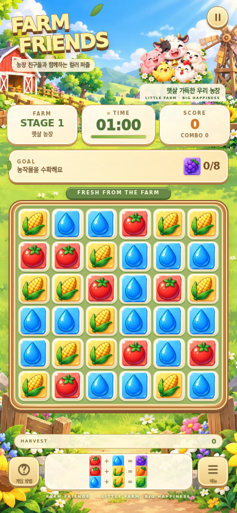
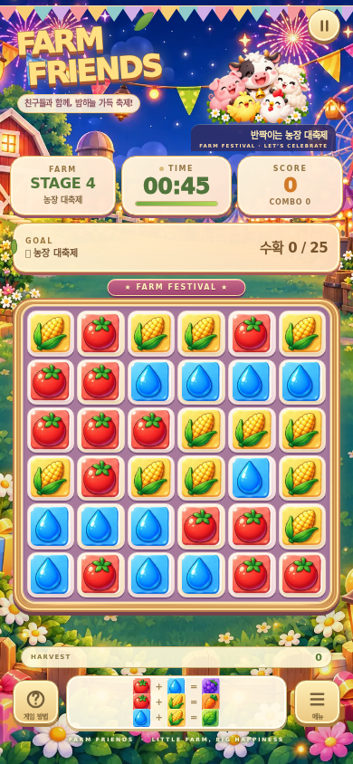
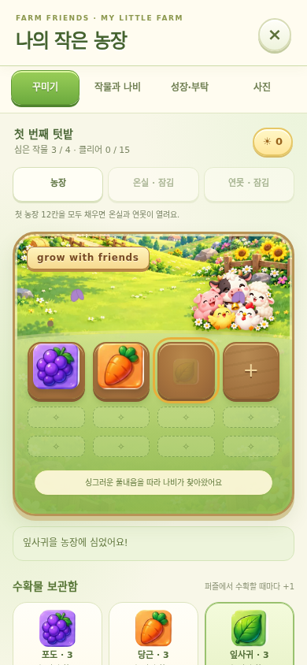

> 업데이트: 텃밭·농장 관리 기능은 이후 제거되었습니다. 아래는 이전 디자인 개편 당시의 기록입니다. 현재 게임은 퍼즐·콤보·축제 모드만 제공합니다.

# Farm Friends 그래픽 개편 안내

기존 컬러 조합 퍼즐을 사용자께서 제공하신 두 그래픽 시안에 맞춰, 낮에는 아기자기한 농장을 즐기고 특별 스테이지에서는 밤의 축제에 참여하는 **Farm Friends** 콘셉트로 개편했습니다. 이 문서는 실제 코드에 반영한 디자인과 게임 규칙, 그리고 다음 업데이트에서 선택하실 수 있는 확장 방향을 설명합니다. 배포 상태나 최종 검증 결과는 별도의 작업 결과 안내를 기준으로 확인해 주세요.

## 두 시안을 게임에 적용한 설계 근거

두 시안은 서로 다른 게임을 표현하는 자료라기보다, 같은 농장에 시간과 행사가 더해진 세계로 연결하기 좋습니다. 기본 시안에는 햇살, 나무 울타리, 농작물, 둥근 동물 캐릭터가 반복되고, 축제 시안에는 여기에 등불, 풍선, 선물, 불꽃놀이가 추가됩니다. 따라서 평소 화면은 밝은 녹색과 크림색, 나무색을 중심으로 구성하고, 축제에서는 보라빛 밤하늘과 따뜻한 조명을 더했습니다. 농장 친구들과 나무 질감은 두 화면에 공통으로 유지해, 특별 스테이지에 들어갔을 때 같은 장소에서 행사가 시작되었다고 느끼실 수 있도록 했습니다.

게임 화면에서 가장 먼저 읽혀야 하는 정보는 현재 스테이지, 남은 시간, 수확 목표, 그리고 손가락으로 움직일 타일입니다. 참조 시안은 많은 자산을 한 장에서 비교하도록 만든 자료이므로, 그 전체를 화면 배경으로 붙이면 작은 타일과 안내 문구가 서로 경쟁하게 됩니다. 이번 개편에서는 시안의 개별 타일을 게임 안에서 직접 사용하고, 큰 배경과 캐릭터 묶음은 별도의 이미지로 보완했습니다. 배경은 농장의 분위기를 맡고, 크림색 정보 패널과 목재 퍼즐판은 실제 조작 영역을 또렷하게 만드는 역할을 합니다. 사용자가 장식 사이에서 목표 숫자를 찾아야 하는 상황을 줄이는 구성입니다.

기존 퍼즐의 재미는 세 가지 재료를 조합하고, 같은 결과를 연속해서 만들어 콤보를 이어가는 데 있습니다. 그래서 참조 이미지에 타일이 여덟 종류 있다고 해서 입력 재료를 여덟 종류로 늘리지는 않았습니다. 현재 규칙의 빨강·파랑·노랑에 각각 토마토·물방울·옥수수를 대응시키고, 조합 결과인 보라·주황·초록에는 포도·당근·잎사귀를 대응시켰습니다. 새 그림으로도 기존 색 조합을 따라가실 수 있으며, 목표 패널과 화면 아래 조합 안내에서도 같은 이미지를 사용합니다. 이 조합은 게임 속 색 조합 규칙이며 실제 작물의 재배 과정을 뜻하지는 않습니다.

동물 친구들은 농장의 분위기를 만드는 안내자 역할로 배치했습니다. 퍼즐판의 모든 칸에 캐릭터를 넣으면 표정과 재료의 형태를 동시에 구분해야 하므로, 캐릭터 묶음은 상단과 농장 화면, 기념사진에 사용했습니다. 타일은 윤곽이 분명한 농작물과 물방울로 통일해 화면이 작아져도 조작 대상이 드러나게 했습니다. 현재 캐릭터 이미지는 정지 그림입니다. 참조 시안에 있는 표정 변화나 개별 동물 코스튬을 모두 움직이는 애니메이션으로 구현한 것은 아니며, 그런 요소는 후속 확장 항목으로 구분했습니다.

축제는 배경만 교체하는 장면이 아니라 게임 진행 안에서 만나는 특별한 구간입니다. 현재 전체 15개 스테이지 중 4번째가 농장 대축제이며, 45초 동안 종류를 합산해 수확물 25개를 만드는 목표를 유지합니다. 이때 밤 배경, 가랜드, 축제 이름표, 따뜻한 패널 색과 타일 주변 효과가 함께 바뀝니다. 풍선·바람개비·선물 그래픽은 합성 주변의 축제 장식으로 등장합니다. 일반 스테이지의 재료와 조합법은 그대로여서 새로운 설명을 길게 읽지 않고도 바로 축제에 참여하실 수 있습니다.

이미 강화되어 있던 콤보와 합성 효과는 농장 테마에서도 이어집니다. 빛의 고리, 반짝임, 입자, 나비와 클리어 축하 효과를 유지하면서 화면의 기본 재질과 글자 색을 새 테마에 맞췄습니다. 계속 화려하게 움직이는 요소와 조작 중 순간적으로 나타나는 요소를 구분해, 배경은 장소를 설명하고 합성 효과는 성공을 알려주도록 했습니다. 기기의 동작 줄이기 설정을 확인하는 기존 처리도 유지합니다. 시각 효과의 세부 표현이 줄어들더라도 수확 목표와 콤보 정보는 숫자로 확인하실 수 있습니다.

이번 변경의 범위에는 기존 정원을 ‘나의 농장’으로 이어 주는 작업도 포함됩니다. 저장에 쓰는 키와 작물의 내부 식별자를 유지해, 화면 이름이 바뀌어도 기존 보유량·배치·장식·진행 기록을 이어 읽도록 구성했습니다. 저장 구조는 기존 코드의 검증과 이전 버전 처리 흐름을 사용합니다. 같은 브라우저와 같은 사이트 주소에서 기록을 이어가는 로컬 저장 방식이며, 다른 기기와 자동으로 동기화하는 계정 기능은 이번 변경에 포함되지 않습니다. 농장의 사진 만들기에도 새 배경과 캐릭터를 반영해 게임 화면과 저장 이미지의 분위기를 연결했습니다.

유지보수 측면에서는 게임 동작을 `game.js`로 분리하고, 기본 화면과 농장 화면의 새 디자인을 각각 별도 CSS에 모았습니다. 사용자 제공 참조 원본 두 장은 PNG 그대로 유지합니다. 새로 생성한 그림 세 장만 모바일 로딩을 위해 WebP 형식으로 변환했으며, 두 종류 모두 저장소의 `assets` 폴더에서 불러옵니다. 생성 원본은 PNG이며, 형식 변환 과정에서 그림의 내용과 캐릭터의 투명 배경은 유지합니다. 개별 타일은 브라우저가 참조 시트의 지정 영역을 캔버스로 한 번 추출해 사용합니다. 외부 이미지 서비스에 매번 의존하지 않으며, 추출한 타일을 농장 사진에도 재사용합니다. 이 방식은 원본 시안의 형태와 색을 유지하면서 필요한 부분만 게임에 넣기 위한 선택입니다.

## 12가지 디자인 적용 방향

### 1. 햇살이 들어오는 농장 입구 — 적용 완료

첫 화면은 밝은 농장 배경과 Farm Friends 이름, 동물 친구들, 오늘의 수확 목표가 함께 보이도록 구성했습니다. 농장은 게임의 장소이고, 목표 카드와 시작 버튼은 지금 할 일을 알려주는 구조입니다. 로고에는 나무 간판을 연상시키는 갈색 윤곽과 노란 글자, 작은 잎 장식을 적용했습니다. 상단 그림과 퍼즐판 사이에는 스테이지·점수·시간 패널을 배치해 귀여운 분위기를 보면서도 진행 정보를 놓치지 않게 했습니다. 화면 높이가 부족한 경우에는 상단 장식과 글자 크기를 조정하는 반응형 규칙을 사용합니다. 배경 속 세부 장식의 위치를 모두 버튼으로 만들지는 않았으며, 실제 조작 가능한 부분은 기존 게임 버튼과 타일로 명확히 구분했습니다.

### 2. 세 가지 재료와 세 가지 수확물 — 적용 완료

기존 색 조합을 토마토·물방울·옥수수와 포도·당근·잎사귀로 표현했습니다. 조합 결과가 성공하는 순간에는 새 수확물 그림이 나타나고, 하단의 수확 기록에도 같은 그림이 쌓입니다. 목표 패널에 표시하는 이미지 역시 실제 결과 타일과 같아서, 사용자가 목표 이름을 외우지 않아도 시각적으로 연결할 수 있습니다. 재료를 뜻하는 기본 그림과 결과를 뜻하는 그림을 구분하면서도 원래 색 계열은 보존했습니다. 참조 시안의 다른 타일은 필요한 범위에서 자산으로 준비했지만, 모든 그림에 새 규칙을 부여하지는 않았습니다. 현재 조합은 아래의 세 가지이며, 대각선이 아닌 상하좌우로 이웃한 칸끼리 합성하는 방식입니다.

| 재료 조합 | 수확물 |
| --- | --- |
| 토마토 + 물방울 | 포도 |
| 토마토 + 옥수수 | 당근 |
| 물방울 + 옥수수 | 잎사귀 |

### 3. 손으로 만지는 나무 퍼즐판 — 적용 완료

퍼즐판 테두리는 밝은 목재색과 짙은 나무 가장자리로 바꾸고, 칸에는 크림색 바탕과 짧은 그림자를 적용했습니다. 타일 뒤가 너무 어둡지 않도록 해 토마토의 빨강과 물방울의 파랑이 잘 드러나게 했습니다. 기존 6×6 격자와 보드 크기 조정 함수를 유지하면서, 테두리 안에서 실제 격자가 차지하는 면적을 넓히는 디자인을 적용했습니다. 이 때문에 작은 화면에서도 조작할 칸을 확보하는 방향으로 구성됩니다. 눌린 타일은 잠깐 작아지고, 새 타일은 다시 채워지는 기존 반응을 사용합니다. 장식은 보드 바깥과 테두리에 집중하고, 칸 안에는 재료 그림을 중심으로 남겨 퍼즐의 빠른 판단을 돕습니다.

### 4. 밤이 되면 열리는 농장 대축제 — 적용 완료

4번째 스테이지에는 별도의 야간 축제 배경을 사용합니다. 일반 농장의 초록색 분위기에서 보라색 밤하늘과 황금 조명으로 전환되고, 퍼즐판 위의 간판도 FARM FESTIVAL로 바뀝니다. 상단 가랜드와 밝은 패널은 밤 배경에서도 농장 특유의 따뜻한 느낌을 이어 줍니다. 축제는 전체 수확량을 합산하므로 포도·당근·잎사귀 중 만들 수 있는 조합을 빠르게 이어 가시면 됩니다. 현재 축제의 위치와 목표는 기존 스테이지 데이터에 맞춘 것이며, 모든 네 번째 스테이지마다 축제가 반복되는 무한 생성 구조는 아닙니다. 15개 스테이지 안의 특별한 변화로 구성해 일반 수확 구간과 분명한 리듬 차이를 만듭니다.

### 5. 성공할수록 풍성해지는 수확 효과 — 적용 완료

합성 성공은 수확물의 등장, 점수 표시, 빛의 고리, 반짝임이 함께 전달합니다. 콤보가 높아지면 주변 효과가 더 풍성해지고, 축제에서는 바람개비·풍선·선물 그림을 활용한 장식이 더해집니다. 기존 효과 코드의 연출 계층과 노드 수 제한을 이어 사용하므로, 이번 개편을 위해 무제한으로 입자를 추가하는 방식은 사용하지 않았습니다. 피버가 시작되면 보드 가장자리와 FEVER TIME 표시가 함께 반응합니다. 현재 피버 조건은 같은 수확물 8콤보이며, 5초 동안 수확 점수에 1.5배가 적용됩니다. 더 화려한 화면이 어떤 플레이 성과와 연결되는지 알 수 있도록, 콤보 숫자와 시간 보너스 표시도 함께 유지했습니다.

### 6. 작은 화면에서 읽히는 수확 목표 카드 — 적용 완료

현재 목표는 목재 느낌의 얇은 테두리와 밝은 종이색 카드 안에 배치했습니다. 수확물 그림과 ‘현재 수량/목표 수량’을 바로 붙여 두어 이미지와 숫자를 한 덩어리로 읽으실 수 있습니다. 목표가 여러 종류인 스테이지에는 각 수확물을 나란히 표시하고, 콤보 조건이 있는 경우에는 별도 줄에 필요한 최고 콤보를 보여줍니다. 목표를 완료한 항목은 글자 색으로도 변화를 줍니다. 남은 시간은 숫자와 막대를 함께 사용하고, 시간이 적어지면 붉은 색으로 바뀌는 기존 경고를 이어 갑니다. 테마의 귀여움은 테두리와 색, 이미지가 담당하고, 진행에 필요한 숫자는 단순한 구조로 남겨 플레이 중 빠르게 확인하시도록 했습니다.

### 7. 퍼즐의 보상이 자라는 ‘나의 농장’ — 적용 완료

기존 정원은 새 수확물과 어울리는 ‘나의 농장’으로 표현을 바꿨습니다. 포도·당근·잎사귀를 보관하고 배치하는 흐름, 텃밭 확장, 장식 전시, 도감과 기록을 이어 사용합니다. 첫 농장 외에 온실과 연못을 포함하는 기존 공간 구조도 유지합니다. 화면은 밝은 종이 카드, 초록색 선택 표시, 작은 텃밭 칸을 중심으로 정리해 게임의 목재 보드와 같은 분위기를 갖게 했습니다. 이것은 이번에 모든 농장 기능을 새로 만든다는 뜻이 아니라, 이미 있는 꾸미기와 보상 흐름에 새 그림과 언어를 적용한 작업입니다. 화면 디자인이 바뀌어도 사용자가 모아 둔 내용이 연결되도록 내부 저장 식별자를 유지한 점이 핵심입니다.

### 8. 낮·노을·밤이 이어지는 농장 분위기 — 적용 완료

농장 화면의 기존 봄 햇살·노을·달빛 테마를 새 이미지에 맞춰 표현했습니다. 낮에는 햇살 농장 배경을 사용하고, 밤 테마에는 축제 배경을 사용해 플레이에서 본 장소를 꾸미기 화면에서도 이어서 경험하실 수 있습니다. 노을과 공간별 분위기는 CSS 색과 덧씌우는 효과로 조정합니다. 모든 테마마다 완전히 다른 원본 배경 그림을 새로 만든 구성은 아닙니다. 이 방식으로 이미지 수를 과도하게 늘리지 않으면서도 시간대의 차이를 전달합니다. 각 테마와 공간은 기존 해금 조건을 따르며, 이번 그래픽 변경이 보유 기록이나 해금 기준을 임의로 초기화하지 않도록 기존 저장 흐름과 연결했습니다.

### 9. 농장 친구들과 함께 남기는 기념사진 — 적용 완료

사진 만들기는 농장의 이름과 선택한 공간, 시간대, 현재 배치한 수확물과 장식, 동물 친구들을 한 장의 PNG에 그립니다. 화면에 쓰는 농장 배경과 타일 이미지를 내보내기에서도 활용해 사진만 예전 꽃 테마로 남는 일이 없도록 연결했습니다. 사진을 만드는 순간의 농장 상태를 복사해 사용하므로, 이미지가 준비되는 동안 다른 탭을 누르더라도 한 장에 서로 다른 시점의 배치가 섞이지 않게 구성되어 있습니다. 사진 이름과 기록 표시, 획득한 프레임 관련 기존 옵션도 유지합니다. 완성된 이미지는 미리보기에서 확인한 뒤 저장하실 수 있으며, 사진 만들기 자체가 외부 서비스에 자동 게시하거나 다른 사람에게 전송하는 동작은 아닙니다.

### 10. 원본 시안의 그림을 살리는 자산 구성 — 적용 완료

사용자 제공 시트 두 장을 그대로 자산 폴더에 두고, 필요한 사각형 영역만 브라우저 캔버스에서 읽어 각 타일 이미지로 사용합니다. 원본 크기를 기준으로 좌표 비율을 계산하고, 결과 타일은 144×144 크기로 준비합니다. 둥근 모서리와 이미지 보간을 적용해 보드 위에서 일관된 형태가 되게 했습니다. 이는 각 그림의 배경을 모두 투명하게 제거한 독립 원화 세트와는 다른 구성입니다. 참조 시트의 타일 카드 표현을 살려 사용하는 현재 방식에 맞춰 퍼즐 칸도 디자인했습니다. 처음 시작할 때 자산 준비를 기다리는 문구를 표시하고, 참조 시트를 불러오지 못하면 재시도 안내를 보여주도록 했습니다. 게임에서 실제 사용하는 파일과 원본의 관계도 아래 목록에 정리했습니다.

### 11. 성공과 실패에 반응하는 동물 친구들 — 후속 확장 아이디어

다음 단계에서는 현재 정지 캐릭터 묶음을 바탕으로, 대표 동물 한 마리의 기본·응원·기쁨·아쉬움 표정을 따로 준비하실 수 있습니다. 예를 들어 목표 하나를 완료하면 소가 손을 흔들고, 최고 콤보를 갱신하면 병아리가 뛰며, 시간이 끝나면 다시 해보자는 표정을 보여주는 방식입니다. 캐릭터의 반응은 보드 바깥의 고정 자리에서 짧게 재생하면 조합 판단을 방해하지 않으면서 게임에 성격을 더할 수 있습니다. 우선 표정 네 가지와 짧은 움직임부터 시작한 뒤 실제 플레이에서 빈도를 조정하는 편이 적합합니다. 이 항목의 상태별 캐릭터 애니메이션과 이벤트 연결은 현재 구현에 포함되지 않았으며, 정지 이미지 배치와 구별되는 다음 작업입니다.

### 12. 계절 축제와 수집하는 농장 장식 — 후속 확장 아이디어

기본 농장과 밤 축제의 두 장면을 바탕으로, 이후에는 봄 꽃시장·여름 물놀이·가을 수확제·겨울 등불 축제로 확장할 수 있습니다. 같은 퍼즐 규칙을 유지하면서 목표 카드의 장식, 배경의 계절색, 축제 기념품만 바꾸면 익숙함과 새로움을 함께 줄 수 있습니다. 보상은 기능이 겹치는 재화를 여러 개 만드는 것보다, 농장에 놓을 작은 풍차·피크닉 테이블·계절 꽃수레 같은 시각적 장식부터 검토할 수 있습니다. 참조 시안의 개체를 쓰려면 개별 이미지 정리와 구매·획득 조건, 저장 항목, 사진 반영을 함께 구현해야 합니다. 현재는 이러한 계절 이벤트와 신규 장식 보상 체계를 추가하지 않았으며, 기존 농장 장식·부탁·도감 기능 위에 연결할 후보로 제안드립니다.

## 이번 변경에서 유지한 게임 규칙

| 항목 | 현재 동작 |
| --- | --- |
| 퍼즐판 | 6×6, 상하좌우 이웃 칸을 합성합니다. |
| 기본 재료 | 토마토·물방울·옥수수의 세 가지입니다. |
| 콤보 | 같은 수확물을 연속해서 만들 때 이어집니다. 두 번째부터 매회 0.2초를 더하며, 시간은 해당 스테이지 기본 시간보다 최대 8초 높은 값까지 제한됩니다. |
| 피버 | 같은 수확물 8콤보에서 시작하며 5초 동안 점수 1.5배가 적용됩니다. |
| 나비 | 다른 재료를 나비가 있는 칸으로 합성하면 해당 수확 점수 2배가 적용됩니다. 시간 보너스는 없습니다. |
| 스테이지 | 총 15개입니다. 목표를 완료하면 클리어 연출 뒤 다음 스테이지 준비 화면으로 이동합니다. 마지막 다음에는 처음 스테이지로 이어집니다. |
| 축제 | 4번째 스테이지, 45초 동안 종류 합산 수확물 25개가 목표입니다. |
| 기록 | 기존 로컬 저장 키와 내부 작물 식별자를 유지하며, 기존 농장 저장 검증 흐름을 사용합니다. |

## 파일과 그래픽 출처

참조 그래픽의 출처는 **사용자 제공 이미지 `9657.png`, `9658.png`**입니다. 새로 보완한 배경과 캐릭터 이미지는 이번 작업에서 AI로 생성한 그림입니다. 생성 원본은 PNG 세 장이고, 게임에는 로딩 용량을 줄인 WebP 세 장을 사용합니다. 별도의 작가 원화를 구매했다고 표시하지 않습니다. 참조 시트에 나오는 모든 장애물·부스터·동물 의상·상점 기능을 구현했다는 의미는 아닙니다.

추가 그림 제작에는 ChatGPT의 내장 이미지 생성 기능(`image_gen.imagegen`)을 사용했습니다. 요청한 아트 방향의 요약은 다음과 같습니다. 이는 생성 요청의 핵심을 정리한 내용이며 프롬프트 전문은 아닙니다.

| 생성 그림 | 요청한 아트 방향 요약 |
| --- | --- |
| 낮 농장 배경 | 사용자 시안과 어울리는 아기자기한 농장, 밝은 햇살과 부드러운 색감, 퍼즐 화면의 배경으로 사용할 장면입니다. |
| 야간 축제 배경 | 같은 농장이 밤 축제 장소가 된 모습, 등불과 장식, 따뜻한 조명으로 낮 장면과 이어지는 분위기입니다. |
| 농장 친구들 | 소·돼지·양·닭·병아리 다섯 동물을 함께 배치한 귀여운 캐릭터 묶음이며, 화면 위에 겹쳐 사용할 수 있는 투명 배경입니다. |

| 파일 | 역할 |
| --- | --- |
| `index.html` | 게임 화면 구조와 테마 파일 연결입니다. |
| `game.js` | 기존 게임 로직을 분리한 파일이며, 새 자산·문구·농장 사진을 연결합니다. |
| `assets/farm-theme.css` | 기본 퍼즐 화면과 축제 화면의 색, 재질, 배치 표현입니다. |
| `assets/farm-garden.css` | 나의 농장과 도감·기록·사진 화면의 테마입니다. |
| `assets/farm-assets.js` | 참조 시트에서 타일 영역을 추출하고 게임이 사용할 자산을 준비합니다. |
| `assets/farm-reference.png` | 사용자께서 제공하신 기본 농장 그래픽 참조 시트입니다. |
| `assets/festival-reference.png` | 사용자께서 제공하신 축제 그래픽 참조 시트입니다. |
| `assets/farm-day.webp` | 새로 생성한 낮 농장 배경의 게임용 WebP입니다. |
| `assets/farm-festival.webp` | 새로 생성한 밤 축제 배경의 게임용 WebP입니다. |
| `assets/farm-mascots.webp` | 새로 생성한 농장 친구들 묶음의 게임용 WebP이며 투명 배경을 유지합니다. |

## 간단한 사용 방법

1. 게임을 열고 그림 준비가 끝나면 **시작하기**를 눌러 주세요.
2. 화면 아래 조합표를 보면서 이웃한 재료를 상하좌우로 밀어 목표 수확물을 만들어 주세요.
3. 같은 수확물을 연속해서 만들면 콤보와 시간 보너스를 받을 수 있습니다. 목표를 완료하면 다음 스테이지로 이동합니다.
4. 4번째 스테이지에서는 밤의 농장 대축제가 열립니다. 세 종류 중 어떤 수확물을 만들어도 합산 목표에 포함됩니다.
5. 시작 화면이나 쉬어가기 화면의 **나의 농장**에서 보관한 수확물을 심고, 획득한 장식과 기록을 확인해 주세요.
6. 농장의 **사진** 탭에서 이름과 표시 옵션을 정한 뒤 사진을 만들고, 미리보기를 확인한 다음 저장하시면 됩니다.

새 그림이 보이지 않는 경우에는 페이지를 새로고침해 주세요. 저장 기록을 이어 쓰시려면 기존과 같은 브라우저에서 같은 사이트 주소로 접속해 주세요.

## 검증 결과

기존 회귀 검사 **239개**를 통과했습니다. 기본 조합·콤보·피버 25개, 나비·축제 41개, 스테이지·난이도 57개, 정원 38개, 정원 성장·저장·사진 78개입니다. 색 조합, 점수와 시간 계산, 자동 스테이지 이동, 저장 마이그레이션, 사진 내보내기 검사를 유지했습니다. 표시 이름과 외부 파일을 제공하는 테스트 서버만 새 구조에 맞췄습니다.

320×568, 360×740, 390×844, 480×960 화면에서도 기본·축제·EXPERT 총 12개 장면과 농장 화면을 추가 확인했습니다. 작은 화면에서 콤보, 획득 점수, 피버 배지가 겹치지 않도록 표시 영역을 나눴습니다. 참조 그림을 불러오지 못할 때 재시도 버튼이 표시되는 것도 확인했습니다. 브라우저 실행 오류는 발견되지 않았습니다.

