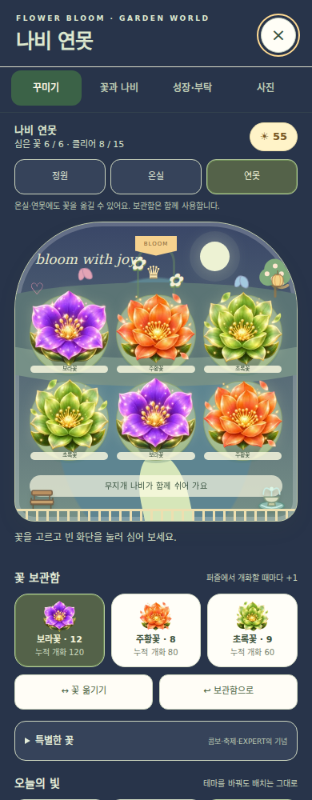
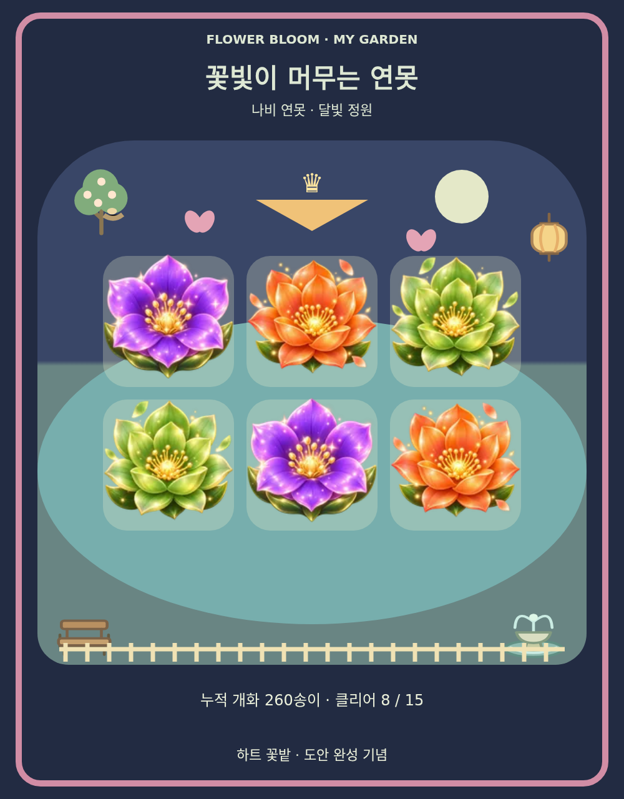

# Garden World v2 — 정원 확장 10종

기준 커밋: 정원 1차 `16e49184f4d6bbf773992a1ff32a4a3b9fe7ee0e`.

이전 제안의 10가지 기능을 기존 정원과 연결했습니다. 게임 파일은 여전히 `index.html` 하나이며 추가 서버·로그인·원격 이미지·외부 스크립트를 요구하지 않습니다. 이 문서의 화면과 사진은 기능을 보여 주기 위한 예시 저장 데이터로 생성했습니다. 실제 신규 게임은 기본 꽃 각 1송이, 햇살 0, 화단 4칸에서 시작합니다.

## 어디에서 사용하는가

시작 화면·메뉴·결과 화면 → **나의 정원**. 상단의 네 메뉴로 기능을 나눴습니다.

| 메뉴 | 기능 |
| --- | --- |
| 꾸미기 | 꽃 심기·이동·회수, 공간 선택, 특별한 꽃, 테마, 도안, 장식 |
| 꽃과 나비 | 꽃별 개화 기록, 기념꽃 조건, 나비 발견 기록과 초대 |
| 성장·부탁 | 응원 나무, 잎 색, 정원의 부탁과 보상 수령, 축제 기록 |
| 사진 | 이름, 기록 표시, 움직임 정지, 기념 테두리, PNG 생성과 다운로드 |

## 설계와 연결 방식

이번 확장의 중심은 퍼즐에서 한 번 꽃을 피우는 행동이 여러 기록으로 자연스럽게 이어지게 하는 것입니다. 꽃은 보관함에 들어가고, 해당 꽃의 도감 수량이 늘며, 응원 나무의 성장에도 반영됩니다. 정원에서 꽃을 심거나 자리를 옮기는 행동은 배치 도안과 나비 방문 조건으로 연결됩니다. 사용자가 새로운 버튼마다 별개의 규칙을 외우기보다 이미 하는 행동에서 다음 목표를 발견하도록 구성했습니다. 원래의 색 조합과 점수 계산은 그대로 유지합니다.

보상은 얻는 시점과 사용하는 시점을 구분했습니다. 일반 꽃은 합성 직후 저장하고, 클리어 햇살은 스테이지 종료 시 자동 지급합니다. 부탁의 햇살은 진행 상황을 확인한 뒤 받기 버튼으로 수령하며, 기념꽃은 조건을 달성하면 한 번만 지급합니다. 어떤 화면에서 보상을 받아야 하는지가 섞이면 놓쳤다고 느끼기 쉬우므로, 각각의 상태를 안내 문구와 보관함·도감에 표시합니다. 부탁 수령 후에는 새로운 기준점이 기록되어 같은 개화량으로 다음 보상을 다시 받을 수 없습니다.

짧은 플레이와 장기 목표가 함께 존재하도록 성장 기준을 여러 크기로 나눴습니다. 도감은 꽃별 10·30·75송이, 응원 나무는 전체 개화 10·30·60·120·240송이를 기준으로 합니다. 별빛 꽃은 콤보, 태양꽃은 축제, 비취꽃은 고난도 클리어에서 얻습니다. 서로 다른 기록이 같은 한 판에서 함께 진행될 수 있으며, 실패한 판의 유효한 개화도 꽃과 나무 기록으로 남습니다. 수치의 적절성은 실제 플레이 시간과 성취 속도를 관찰하면서 조정할 수 있습니다.

정원 편집에는 실험할 여지를 유지했습니다. 꽃을 회수하면 보관함으로 돌아오고, 특별한 꽃도 같은 방식으로 옮길 수 있습니다. 온실과 연못은 공용 보관함을 이용하므로 첫 정원에서 회수한 꽃을 다른 공간에 심을 수 있습니다. 도안을 완성한 뒤 꽃을 바꾸어도 기념 테두리는 유지되고, 나비를 발견한 뒤 유인 조건을 바꾸어도 방문 기록은 남습니다. 꾸민 모습을 한번 결정했다고 계속 유지해야 하는 부담을 줄이기 위한 규칙입니다.

화면은 기능의 목적에 따라 나눴습니다. 꾸미기에서는 화단과 보관함을 보고, 도감에서는 기록을 읽으며, 성장 화면에서는 다음 보상을 확인하고, 사진 화면에서는 정원을 남깁니다. 잠긴 기능도 조건을 표시해 앞으로 무엇이 열리는지 알 수 있습니다. 모바일에서 한 화면에 모든 설명을 넣는 대신 일부 항목을 펼쳐 볼 수 있게 했습니다. 잠긴 화단은 낮게 표시하여 초반부터 비어 있는 공간이 화면 대부분을 차지하지 않도록 조정했습니다.

꾸미는 동안에는 기존 일시 정지 동작을 그대로 사용합니다. 타이머, BLOOM의 잔여 시간, 퍼즐 나비의 방문 시각을 유지하며, 정원을 닫으면 들어오기 전 메뉴 상태로 돌아갑니다. 정원의 나비는 퍼즐 점수 나비와 별개로 그려지므로 수집한 방문객이 점수 배율에 영향을 주지 않습니다. 테마나 잎 색도 시각적인 선택이며 퍼즐의 난이도나 보드 생성 확률은 바꾸지 않습니다. 효과를 위한 새로운 난수 호출 역시 퍼즐 생성 과정에 추가하지 않았습니다.

이전 저장 데이터는 버전을 확인한 뒤 확장 필드를 추가합니다. 기존 꽃, 햇살, 배치, 장식, 클리어 기록과 다음 스테이지를 유지하고, 이전 원문은 새 버전을 쓰기 전에 따로 백업합니다. 이전 기록만으로 확인할 수 있는 축제·EXPERT 클리어 보상은 지급하지만, 과거에 저장하지 않았던 첫 개화 스테이지나 최고 콤보를 추측해 넣지는 않습니다. 이전 누적 개화는 도감과 나무에 반영하되 새 부탁은 해당 시점부터 새로 진행됩니다.

사진 기능은 정원 상태를 한 번 복사한 뒤 그 상태로 이미지를 만듭니다. 그림을 불러오는 동안 다른 탭을 누르더라도 서로 다른 배치가 섞이지 않도록 했습니다. 저장할 사진을 먼저 보여 주고 사용자가 내려받기 버튼을 눌러 PNG를 받습니다. 계정 연결이나 외부 공유는 수행하지 않습니다. 이 기능은 화면 전체를 그대로 캡처하는 방식이 아니라 버튼을 제외한 정원을 사진용 구도로 다시 그리는 방식이며, 이름과 테두리 및 기록 표시를 포함합니다.

## 10가지 아이디어의 실제 적용

1. **꽃 도감.** 보라·주황·초록꽃마다 누적 개화 수, 첫 개화 스테이지, 가장 높은 같은 꽃 콤보, 축제에서 피운 수량을 기록합니다. 10·30·75송이에 따라 도감 단계가 표시되며 다음 단계까지 필요한 수량도 확인할 수 있습니다. 한 종류를 10송이 피우면 꽃 이름표를 받습니다. 이름표를 전시하면 화단의 꽃 아래에 이름이 나타나고, 보관하면 다시 숨겨집니다. 심기·교환·회수는 기록을 줄이지 않습니다. 이전 버전에 없던 세부 이력은 이전 기록으로 구분하여 과거 성취를 새로 만들어 내지 않도록 했습니다. 최고 콤보와 축제 수량은 실제 합성 이벤트를 통해 누적합니다.

2. **특별한 기념꽃.** 같은 꽃 8콤보로 별빛 보라꽃, 만개 축제 첫 클리어로 축제의 태양꽃, EXPERT 스테이지 첫 클리어로 비취 왕관꽃을 얻습니다. 각 기념꽃은 한 송이만 지급하고 금빛 강조와 별·왕관 등의 표식으로 구별합니다. 보관함의 특별한 꽃 항목에서 선택해 일반 꽃처럼 심거나 회수할 수 있습니다. 도감에는 아직 얻지 못한 꽃도 조건과 함께 나타나며, 얻은 꽃이 현재 보관함에 있는지 정원에 심겨 있는지도 표시됩니다. 같은 조건을 다시 달성하거나 화면을 여러 번 열어도 수량이 늘지 않습니다. 온실과 연못에도 옮길 수 있으므로 전용 전시 공간처럼 활용할 수 있습니다.

3. **세 가지 정원 테마.** 봄 햇살은 처음부터 선택할 수 있고, 서로 다른 스테이지 3개를 클리어하면 노을 정원, 6개를 클리어하면 달빛 정원이 열립니다. 배경, 지면, 해와 달, 화면 색상 등이 함께 바뀌며 꽃 배치와 보유 재료는 그대로 유지됩니다. 테마는 저장되므로 다시 접속해도 선택한 분위기로 돌아옵니다. 첫 정원뿐 아니라 온실과 연못에도 적용되어 같은 꽃을 여러 분위기로 볼 수 있습니다. 달빛 테마에서는 밝은 글자와 선택 상태를 구분하도록 색을 조정했습니다. 테마 해금은 재클리어 횟수가 아니라 서로 다른 스테이지의 완료 기록을 기준으로 합니다.

4. **나비 방문객 수집.** 보랏빛·노을·풀잎·무지개 나비의 네 종류를 수집할 수 있습니다. 보라 계열 꽃 3송이는 보랏빛 나비를, 축제 클리어와 주황 계열 꽃 3송이는 노을 나비를 부릅니다. 초록 계열 꽃 3송이에 분수를 전시하면 풀잎 나비가, 누적 개화 10송이와 세 가지 색의 꽃을 심으면 무지개 나비가 발견됩니다. 조건은 여러 정원에 심은 꽃을 합산하며 특별한 꽃도 해당 기본 색에 포함합니다. 발견한 나비는 도감에서 선택해 다시 초대할 수 있고, 유인용 꽃을 옮겨도 발견 기록은 사라지지 않습니다. 색상과 비행 속도·경로에도 차이를 두었습니다.

5. **정원의 작은 부탁.** 세 가지 색 각각 2송이, 초록꽃 6송이, 같은 꽃 5콤보, 색과 관계없이 12송이라는 네 종류의 부탁이 순서대로 이어집니다. 새 부탁을 받았을 때의 누적 개화를 기준으로 이후 성과만 계산하므로 이미 모아 둔 꽃을 반복 사용해 보상을 얻지는 않습니다. 완료 후 받기를 누르면 햇살 8개를 주고, 첫 부탁 완료에는 울타리 장식도 제공합니다. 부탁을 바꾸는 기능이 있으며 진척이 있을 때는 확인을 거칩니다. 바꾸어도 꽃이나 기존 성취는 유지됩니다. 부탁에는 접속 날짜에 따른 만료가 없어서 짧게 플레이한 결과를 다음 접속에서 이어 갈 수 있습니다.

6. **축제 기념품과 기록.** 스테이지 4의 만개 축제를 완료하면 성공 횟수, 최고 개화량, 최고 콤보가 정원의 축제 기록에 남습니다. 첫 성공은 태양꽃과 축제 깃발을, 누적 3회 성공은 축제 꽃관을 엽니다. 깃발과 꽃관은 기념 장식에서 전시하거나 보관할 수 있으며 정원 위쪽 풍경에 반영됩니다. 같은 클리어 처리가 반복 호출돼도 성공 횟수나 햇살을 더 지급하지 않습니다. 이전 정원에 축제 클리어 기록이 있으면 첫 성공 보상은 인정하지만 저장하지 않았던 과거 최고 개화량을 추정하지는 않습니다. 현실 날짜에 제한을 두지 않아 축제에 다시 도전하며 모을 수 있습니다.

7. **응원 나무.** 전체 누적 개화에 따라 씨앗, 새싹, 잎사귀, 그늘 나무, 새가 머무는 나무, 꽃이 가득한 나무의 여섯 단계로 자랍니다. 성장 기준은 0·10·30·60·120·240송이이며 실패한 판에서 실제로 피운 꽃도 포함합니다. 꽃을 소비하거나 배치를 바꿔도 나무가 줄어들지 않고, 접속하지 않았다고 시들지도 않습니다. 성장 화면에 다음 단계까지 필요한 수량과 진행 막대를 표시하며, 작은 나무 그림은 정원 풍경과 사진에도 포함합니다. 개화 60송이부터는 푸른 잎·분홍 잎·금빛 잎 중 원하는 색을 고를 수 있습니다. 나무는 시각적 성장 요소이며 퍼즐 시간이나 점수를 바꾸지 않습니다.

8. **배치 도안과 기념 테두리.** 기본 4칸에는 작은 무지개, 8칸에는 꽃 체크무늬, 12칸에는 하트 꽃밭 도안을 제공합니다. 선택하면 첫 정원 화단에 색상별 점선이 표시되고, 필요한 배치와 추가로 모을 꽃 수를 확인할 수 있습니다. 선택만으로 꽃을 소비하거나 배치를 바꾸지는 않으며 사용자가 직접 심어 완성합니다. 하트 도안에는 비워 두어야 하는 칸도 포함됩니다. 처음 완성한 도안은 기록으로 남고 사진 테두리와 기념패를 엽니다. 이후 꽃을 바꾸거나 회수해도 보상은 유지됩니다. 특별한 기념꽃은 기본 색이 같은 일반 꽃 대신 도안에 사용할 수 있습니다.

9. **사진 모드와 PNG 저장.** 사진 메뉴에서 정원 이름, 개화·클리어 기록의 표시 여부, 움직임 정지, 보유한 기념 테두리를 선택합니다. 사진 만들기를 누르면 현재 공간과 테마, 꽃 배치, 나무, 장식, 초대 나비를 사진용 구도로 그려 미리 보여 줍니다. 이어 사진 저장을 누르면 실제 1000×1280 PNG 파일을 내려받습니다. 기본 테두리 외에 완성한 도안의 테두리가 추가되므로 꾸미기 성취를 사진에도 남길 수 있습니다. 사진 메뉴에서는 화단을 잘못 눌러도 꽃이 심기지 않습니다. 이미지를 만들거나 저장하는 동작만 제공하며 외부 사이트 게시나 계정 공유를 자동으로 수행하지 않습니다.

10. **온실과 연못.** 첫 정원을 12칸으로 확장하고 모든 칸에 꽃을 심으면 꽃빛 온실과 나비 연못이 동시에 열립니다. 한번 열린 공간은 첫 정원의 꽃을 회수해도 다시 잠기지 않습니다. 두 공간은 각각 6칸의 독립된 배치를 가지며, 온실은 유리 구조물과 기념꽃 전시 분위기, 연못은 물빛 지면과 둥근 화단으로 구분됩니다. 보관함을 함께 사용하므로 꽃을 회수한 뒤 다른 공간에 심어 옮길 수 있고, 일반 꽃과 특별한 꽃 모두 배치할 수 있습니다. 공간을 바꿀 때 진행 중이던 이동 선택을 해제하여 다른 공간의 꽃을 잘못 교환하지 않게 했습니다. 공간별 배치는 모두 저장됩니다.

## 저장과 이전 버전 호환

- 저장 키는 기존 `flower-bloom.garden.v1`을 유지하고 내부 `version`을 `2`로 변경했습니다.
- v1을 읽으면 `flower-bloom.garden.v1.backup-v1`에 원문을 먼저 저장한 뒤 v2를 기록합니다. 백업에 실패하면 원래 v1 저장을 덮어쓰지 않습니다.
- 꽃·햇살·기존 화단·장식·클리어 목록·다음 스테이지는 유지합니다. 새 부탁의 기준점은 이전 누적 개화로 설정합니다.
- v1의 축제 클리어 여부와 EXPERT 클리어 여부로 확인 가능한 기념품은 지급합니다. 과거 첫 개화 스테이지, 최고 콤보, 축제별 개화량은 새로 만들어 넣지 않습니다.
- 손상된 저장이나 지원하지 않는 미래 버전은 원문을 보존하고 임시 세션으로 안내합니다. 기념꽃 중복과 잘못된 수량·이름·배열 항목도 검증합니다.
- 동일 기기·브라우저·사이트 주소 범위의 저장입니다. 계정 동기화와 다른 기기로의 자동 이전은 포함되지 않습니다. 여러 탭의 동시 편집은 원자적인 병합을 제공하지 않습니다.

## 검증 결과

| 검사 | 결과 |
| --- | --- |
| `tests/garden-world.cjs` | 78개 통과 |
| `tests/garden.cjs` | 기존 정원 38개 통과 |
| 신규 정원 기능 검사 합계 | 116개 통과 |
| 화면 크기 | 320×568, 360×740, 412×915, 844×390에서 네 메뉴의 가로 넘침과 돌아가기 접근 확인 |
| 사진 파일 | 실제 다운로드의 PNG 서명과 파일명, 1000×1280 크기 확인 |
| 저장 이전 | v1 원문 백업·재접속·보상 중복 방지·백업 실패 시 원본 보호 확인 |
| 기존 퍼즐 화면 검사 | 아래 3건 실패를 기준 정원 v1에서도 동일하게 재현 |

기존 검사 전체가 통과했다는 의미는 아닙니다. 같은 Chromium 및 글꼴 환경에서 수정 전 `16e49184`와 수정 후를 각각 실행해 다음 실패가 양쪽에 존재함을 확인했습니다.

- `bloom-regression.cjs`: `mobile layout 320x568`
- `butterfly-festival.cjs`: `festival + butterfly + bloom layout 320`
- `skill-stages.cjs`: `stage navigation refits taller combo HUD without a viewport resize 320`

실제 Android 기기의 터치 체감·장시간 성능·다운로드 처리와 운영 배포 주소는 별도 확인이 필요합니다. 정원의 보상 수치와 해금 속도도 실제 반복 플레이로 평가해야 합니다.

실행 예: Playwright와 Chromium이 있는 환경에서 `node tests/garden-world.cjs`. `CHROME_PATH`로 브라우저 실행 파일을, `TEST_SCREENSHOTS`로 검사 화면 저장 경로를 지정할 수 있습니다.

## 사진 모드의 출력 예시

아래는 코드에서 구현한 사진 만들기와 다운로드 버튼으로 생성한 PNG입니다. 예시 저장 데이터이며 실제 신규 사용자에게 이 정원을 지급하는 것은 아닙니다.

