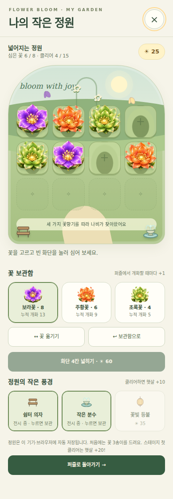

# 나의 작은 정원 — 1차 업그레이드

> 이 문서는 1차 버전의 개발 기록입니다. 아래에서 후속 제안으로 소개한 10가지 기능은 이제 Garden World v2에 구현되어 있습니다. 현재 기능·해금 조건·검증 결과는 [garden-world.md](garden-world.md)를 확인하세요.

기준: `main`의 `9db4f2d4240ecf8f686dc80fdfec0986faa12ee0`.

퍼즐에서 피운 꽃을 영구 보관하고, 화단에 심거나 옮기며, 클리어 보상인 햇살로 화단과 장식을 구매하는 기능입니다. 시작 화면, 일시 정지 메뉴, 실패 결과 화면의 **나의 정원** 버튼으로 들어갑니다. 파일은 기존처럼 `index.html` 하나로 실행됩니다.

위 이미지는 확장·장식 배치를 보여 주기 위한 예시 저장 데이터입니다. 실제 첫 시작은 빈 화단 4칸, 보라·주황·초록꽃 각 1송이, 햇살 0개입니다.

## 이번에 구현한 내용

| 동작 | 결과 |
| --- | --- |
| 성공한 색 조합 | 해당 색 꽃을 보관함에 1송이 추가 |
| 잘못된 조합 | 정원 보상 없음 |
| 스테이지 실패·재시도 | 이미 얻은 꽃 유지 |
| 스테이지 첫 클리어 | 햇살 20개: 기본 10 + 첫 클리어 10 |
| 같은 스테이지 재클리어 | 햇살 10개 |
| 첫 화단 확장 | 햇살 30개 사용, 4칸 → 8칸 |
| 두 번째 화단 확장 | 햇살 60개 사용, 8칸 → 12칸 |
| 쉼터 의자 / 분수 / 등불 | 각각 햇살 15 / 25 / 35개 사용 |
| 보유 장식 다시 누르기 | 보관·전시 전환, 추가 비용 없음 |
| 꽃 선택 후 빈 화단 누르기 | 꽃 1송이 소비해 심기 |
| 다른 꽃이 심긴 화단 누르기 | 기존 꽃을 반환하고 선택한 꽃 심기 |
| 꽃 옮기기 | 꽃과 목적지를 순서대로 누르기; 점유된 화단끼리는 교환 |
| 보관함으로 | 심은 꽃을 비용 없이 반환 |
| 세 가지 색을 모두 심기 | 정원 나비 등장 |

퍼즐의 6×6 보드, 15개 스테이지, 기존 같은 꽃 콤보, +0.2초, BLOOM MODE, 축제, 나비 점수 규칙은 변경하지 않았습니다. 정원 꾸미기는 점수와 난이도에 영향을 주지 않습니다. 꽃마다 누적 개화 수가 표시됩니다.

## 게임 흐름과 저장

- 꽃은 성공한 합성 시점에 저장합니다. 실패 결과를 확인하거나 정원에 들어가야만 보상을 받는 구조가 아닙니다.
- 클리어 보상은 자동으로 지급하고 다음 시작 화면에 표시합니다. 같은 클리어 처리를 반복 호출해도 중복 지급하지 않습니다.
- 마지막으로 클리어한 스테이지의 다음 스테이지를 저장하여 새로고침 후 시작 안내를 표시합니다. 진행 중 보드나 남은 시간까지 복구하는 기능은 아닙니다. 마지막 ST15 이후에는 기존과 같이 ST1로 이동합니다.
- 정원 진입 시 기존 일시 정지 기능을 사용합니다. 타이머, BLOOM 잔여 시간, 나비의 잔여 시간과 다음 방문 시각을 보존합니다. 이미 메뉴에서 정지했다면 정원을 닫아도 메뉴로 돌아가며, 메뉴의 계속하기를 눌러야 재개합니다.
- `localStorage`의 `flower-bloom.garden.v1` 키를 사용합니다. 같은 기기·브라우저·사이트 주소에 저장되며 계정 동기화는 없습니다. 브라우저 사이트 데이터를 삭제하면 기록이 사라집니다.
- 저장을 읽거나 쓸 수 없으면 정원에 안내를 표시합니다. 손상된 JSON 또는 지원하지 않는 저장 버전은 원문을 덮어쓰지 않고 이번 세션을 임시 상태로 유지합니다. 알려진 버전의 수량·화단·장식·스테이지 값은 검증합니다.
- 정원 포커스 이동, Escape 닫기, 배경 조작 차단, 저동작 모드, 짧은 화면의 세로 스크롤을 지원합니다. 새 외부 이미지·폰트·스크립트 의존성은 추가하지 않았습니다.

## 설계 이유

지금 게임은 색 조합을 찾아 빠르게 꽃을 피우는 짧은 성취가 중심입니다. 꽃이 피어나는 연출은 순간의 보상을 제공하지만, 한 판을 마친 뒤 그 꽃을 다시 볼 수 없다면 플레이의 흔적이 점수와 스테이지에 집중됩니다. 정원은 그 흔적을 눈으로 확인할 장소입니다. 퍼즐 한 판에서 얻은 꽃이 다음 접속에도 남고, 사용자가 정한 위치에 피어 있으면 같은 합성 동작에 수집과 표현이라는 의미가 더해집니다. 이 효과는 실제 이용 기록으로 확인해야 하며, 기능 추가만으로 재방문 증가가 입증되는 것은 아닙니다.

짧은 플레이와 긴 성장을 함께 보도록 보상을 나눴습니다. 꽃은 한 번의 성공마다 받고, 햇살은 스테이지를 끝냈을 때 받습니다. 실패해도 꽃은 남으므로 어려운 구간에서 시간을 쓴 결과를 정원에서 확인할 수 있습니다. 동시에 화단 확장에는 햇살이 필요해서 클리어의 가치도 유지됩니다. 첫 클리어는 20개, 재클리어는 10개로 두어 새로운 스테이지를 시도할 이유와 익숙한 스테이지를 다시 즐길 이유를 함께 제공합니다. 이 수치는 초기 제안값이며 플레이 속도를 관찰해 조정할 수 있습니다.

꽃 종류는 퍼즐에서 이미 사용하는 보라·주황·초록과 일치시켰습니다. 별도 재료표를 외우지 않아도 자신이 방금 만든 꽃이 무엇으로 쌓였는지 이해할 수 있습니다. 꽃을 놓을 때는 보관함에서 한 송이를 사용하고, 회수하거나 교체할 때는 돌려줍니다. 처음 정원을 꾸미는 사용자가 배치를 잘못 정했다는 이유로 다시 자원을 모으지 않도록 했습니다. 정원 편집은 반복해서 고칠 수 있는 선택이며, 퍼즐의 긴장감 뒤에 편하게 머무르는 활동을 목표로 합니다.

모바일에서는 자유로운 드래그보다 꽃과 목적지를 차례로 누르는 방식부터 적용했습니다. 작은 꽃을 손가락으로 누른 채 이동시키지 않아도 되고, 화면을 스크롤하려던 동작과 꽃을 옮기려던 동작을 구분하기 쉽습니다. 4열 화단은 보드처럼 위치를 파악하기 쉬우면서 한 화면에 정원 모양을 보여 줍니다. 첫 화단 4칸은 세 가지 꽃을 심어도 여유 한 칸이 남도록 정했습니다. 추가 화단이 잠긴 형태로 보이기 때문에 앞으로 무엇이 늘어나는지도 미리 알 수 있습니다.

시각적 보상은 기존 꽃 그림을 그대로 재사용하고 주변 풍경을 더하는 방향으로 연결했습니다. 사용자가 퍼즐에서 보던 꽃이 정원에서도 같은 모습으로 나타나야 수집한 결과라고 느끼기 쉽기 때문입니다. 의자·분수·등불은 작은 벡터 그림으로 표현하며, 세 가지 꽃을 심으면 나비가 움직입니다. 정원의 나비는 꾸미기 성과를 보여 주는 장식이고 퍼즐의 점수 배율 나비와 계산을 공유하지 않습니다. 움직임을 줄이도록 설정한 환경에서는 심기와 나비 애니메이션을 멈춥니다.

정원에 들어가 있을 때 시간이 흘러가면 사용자는 꾸미기를 게임 진행의 손해로 느낄 수 있습니다. 따라서 기존 메뉴 정지를 이용해 게임 시간과 보너스 잔여 시간을 함께 유지했습니다. 정원을 닫은 뒤에는 들어오기 전의 메뉴 상태를 복원합니다. 시작 화면에서 들어갔으면 계속 시작 전이고, 메뉴에서 들어갔으면 계속 메뉴가 열려 있습니다. 저장도 별도 버튼을 요구하지 않고 보상과 편집 직후 수행합니다. 다만 저장 실패를 성공처럼 보이지 않도록 실패 문구를 제공합니다.

첫 버전의 완료 기준은 많은 기능의 수보다 한 바퀴의 경험입니다. 꽃을 얻고, 심고, 다시 접속해 같은 정원을 보며, 햇살을 모아 화단을 넓히는 과정이 연결되어야 합니다. 이 연결을 확인한 뒤 희귀꽃·테마·도감 등을 더하면 어떤 기능이 다음 플레이 동기를 만드는지 구분하기 쉽습니다. 현재 구현에는 유료 구매, 광고, 온라인 방문, 성장 대기시간이 없습니다. 이후 아이디어는 이 기본 경험을 실제로 이용해 본 결과를 바탕으로 순서를 결정할 수 있습니다.

## 다음 확장 아이디어 10가지 — 아직 미구현

1. **개화 기록이 담긴 꽃 도감.** 같은 색 꽃을 여러 번 피울수록 그 꽃의 기록 페이지가 채워지게 할 수 있습니다. 총 횟수뿐 아니라 처음 얻은 스테이지, 가장 긴 같은 꽃 콤보, 축제에서 피운 수량을 구분하면 자신의 플레이 방식이 보입니다. 도감 단계 보상은 꽃잎 모양이나 화단 표지처럼 눈에 보이는 꾸미기 요소로 시작하는 것이 적절합니다. 완료까지 필요한 수량을 미리 보여 주고, 도감 때문에 원하지 않는 색만 반복해서 만들게 되지 않는지도 살펴보면 좋습니다.

2. **고수의 기록을 담은 특별한 꽃.** 높은 콤보나 어려운 스테이지 첫 성공을 기념하는 꽃 변형을 제안합니다. 기본 색 조합은 그대로 두고 꽃잎 가장자리나 중심 빛만 바꾸면 기존 규칙을 이해한 사용자가 바로 알아볼 수 있습니다. 무작위 획득만 사용하는 대신 조건과 진행 상황을 보여 주면 도전 목표도 됩니다. 조건은 아직 확정하지 않았으며, 같은 종류를 계속 피워야 하는지 여러 색을 만들어야 하는지에 따라 플레이 경험이 달라지므로 별도 검증이 필요합니다.

3. **풍경을 바꾸는 정원 테마.** 봄 정원, 노을 정원, 달빛 정원처럼 같은 배치에서 배경과 조명만 바꾸는 방식입니다. 이미 심은 꽃과 구입한 장식은 유지하고 마음에 드는 분위기를 선택하게 합니다. 처음부터 테마마다 별도 화폐를 만들면 화면이 복잡해지므로 누적 클리어나 정원 완성 기록으로 여는 방식이 단순합니다. 특히 밝은 꽃이 밤 테마에서 얼마나 잘 보이는지, 배경 효과 때문에 모바일 성능이 떨어지지 않는지를 함께 확인하면 좋습니다.

4. **수집하는 나비 방문객.** 현재는 세 가지 꽃을 심었을 때 장식 나비가 나타납니다. 여기에 꽃 구성이나 배치에 따라 다른 나비가 방문하고 도감에 기록되는 구조를 더할 수 있습니다. 방문의 조건을 짧은 힌트로 알려 주면 사용자가 정원을 바꾸어 볼 이유가 생깁니다. 오랫동안 접속하지 않았다는 이유로 방문 기록이 사라지지 않게 하고, 실시간 대기 없이 퍼즐 몇 판의 활동으로 방문 조건을 충족하도록 설계하면 부담이 작습니다.

5. **한 번의 판에서 완성하는 정원 부탁.** 정원이 작은 부탁을 제시하는 방식입니다. 예를 들어 세 가지 색 꽃을 모두 피우거나 이번 판에서 특정 색을 몇 송이 모으면 울타리 장식을 주는 것입니다. 정원의 부탁은 본래 스테이지 목표와 충돌할 수 있으므로 필수 조건으로 넣기보다 보너스로 제공합니다. 요청은 언제든 바꿀 수 있고 실패해도 누적한 꽃은 유지하면 좋습니다. 짧은 플레이에서도 새로운 시도를 하게 만드는지를 먼저 확인할 수 있습니다.

6. **축제와 연결된 기념 화단.** 기존 만개 축제를 완료하면 축제 표식이나 한정 색상의 화분을 받도록 연결할 수 있습니다. 현실 날짜에만 참여할 수 있는 방식보다 게임 안 축제를 다시 플레이해서 얻도록 하면 접속 시각에 대한 부담이 적습니다. 같은 축제를 여러 번 완료했을 때는 수량만 늘리기보다 기념 화분의 단계가 달라지게 할 수도 있습니다. 정원에서 화분을 누르면 어떤 축제에서 얻었는지 보여 주어 플레이 기록과 장식의 관계를 분명히 합니다.

7. **실패해도 자라는 응원 나무.** 어려운 스테이지를 시도하며 실제로 피운 꽃의 수가 정원 구석의 나무 성장에 반영되는 아이디어입니다. 실패 횟수 자체에 보상을 주면 일부러 빨리 실패하는 행동을 부를 수 있으므로 유효한 합성이나 목표 달성 진척을 기준으로 삼는 편이 좋습니다. 나무는 장식의 변화만 제공하고 퍼즐 난이도를 자동으로 낮추지는 않게 설계할 수 있습니다. 사용자가 막힌 구간에서도 자신의 시간이 쌓이고 있다고 느끼는지 살펴보는 장치입니다.

8. **꽃밭을 그리는 배치 도안.** 하트, 줄무늬, 무지개 같은 간단한 도안을 선택하고 필요한 꽃을 직접 모아 완성하는 방식입니다. 자유 배치는 유지하며 도안을 따라 심고 싶은 사용자에게만 도움을 줍니다. 부족한 색과 수량이 보이면 다음 퍼즐에서 무엇을 모으고 싶은지 자연스럽게 정할 수 있습니다. 완성한 도안은 스티커나 사진 장식으로 남기고 언제든 해체해 꽃을 돌려받게 하면, 새 도안을 시도하는 일이 기존 정원을 포기하는 선택이 되지 않습니다.

9. **내 정원을 남기는 사진 모드.** 보관함과 버튼을 잠시 숨기고 정원만 볼 수 있는 화면을 제공하는 아이디어입니다. 정원 이름, 꽃을 피운 총 횟수, 가장 좋아하는 꽃 정도를 사진 틀에 선택적으로 넣을 수 있습니다. 휴대폰에서 캡처하기 좋은 비율부터 지원하면 별도 계정이나 공유 서버 없이도 자기 정원을 남길 수 있습니다. 이후 이미지 저장을 추가하더라도 사용자가 선택하기 전 외부에 게시하지 않고, 꽃 배치가 선명하게 보이는지를 우선합니다.

10. **정원을 마친 뒤 시작하는 두 번째 공간.** 12칸을 모두 연 뒤 기존 정원을 그대로 보존하면서 작은 온실이나 연못 정원을 새로 열 수 있습니다. 단순히 필요한 수량만 크게 늘리기보다 온실은 희귀꽃 전시, 연못은 나비와 장식 배치처럼 공간마다 다른 꾸미기 목적을 주는 편이 좋습니다. 첫 정원에서 모은 꽃을 어느 공간에 둘지 사용자가 선택하게 합니다. 추가 공간의 개발은 실제로 12칸을 채우는 사람이 충분한지와 완성까지 걸리는 시간을 확인한 다음 진행할 수 있습니다.

## 검증 기록

- `tests/garden.cjs`: Chromium 브라우저 검사 38개 통과. 새 정원, 재고, 배치·교환·회수, 실합성 보상, 실패 보존, 첫/재클리어, 중복 지급 방지, 새로고침, 화단 확장, 장식 비용, 일시 정지 복구, 저장 오류, 손상·미지원 저장 버전, 저동작 모드 포함.
- 정원은 320×568, 360×740, 412×915, 844×390에서 가로 넘침과 돌아가기 버튼 접근을 검사했습니다. 320px 세로 및 844px 가로 화면에서 스테이지 안내 창과 정원 입구의 스크롤 접근도 확인했습니다.
- `tests/butterfly-festival.cjs`: 기존 검사 41개 통과.
- 기존 `tests/bloom-regression.cjs`는 `mobile layout 320x568`에서 실패했습니다. 원본 `9db4f2d`에서도 같은 실패를 재현했습니다.
- 기존 `tests/skill-stages.cjs`는 `stage navigation refits taller combo HUD without a viewport resize 320`에서 실패했습니다. 원본 `9db4f2d`에서도 같은 실패를 재현했습니다. 두 기존 검사 전체가 통과했다는 의미는 아닙니다.
- 실제 Android 기기의 터치 체감·성능과 운영 배포 주소는 이번 로컬 검증에 포함되지 않습니다.

실행: Playwright와 Chromium을 사용할 수 있는 환경에서 `node tests/garden.cjs`. 필요하면 `CHROME_PATH`로 브라우저 실행 파일을 지정하고 `TEST_SCREENSHOTS`로 화면 저장 경로를 지정할 수 있습니다.
