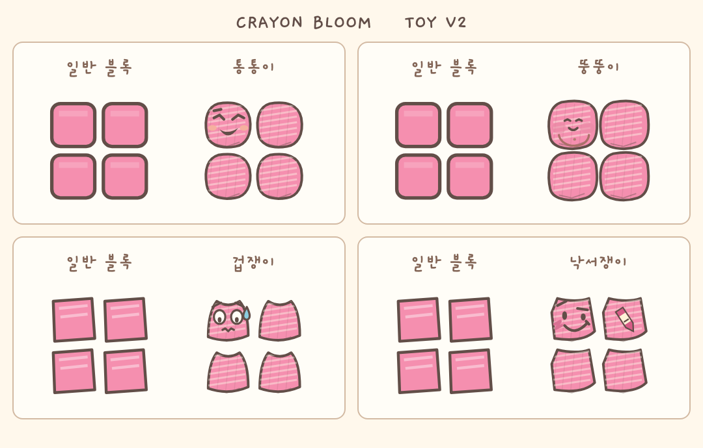

# CRAYON BLOOM · 장난 블록 V2 + 짧은 스와이프 회전

2026-09-29 · 기준 main: `a7ee37e85c90cd9e82f7a5371ef34db884a9fa81`

## 변경 범위

장난 블록은 독립 실험실에서만 동작한다. 본게임에는 장난 블록·60초 타이머·실험실 자산을 연결하지 않았다.
작업 도중 사용자가 추가로 요청한 **길게 누른 뒤 좌우로 밀 때 회전하지 않기**만 본게임에 반영했다.

| 종류 | 등장 외형 | 실제 동작과 문구 |
|---|---|---|
| 통통이 | 둥근 탄력 몸, 휘어진 눈, 개구쟁이 미소 | 접촉 후 95ms 눌림 → 통! → 좌우 한 칸 → 낮은 곳이면 몸도 기울며 데굴~ → 톡! |
| 뚱뚱이 | 칸을 빵빵하게 채우는 몸, 볼·배, 작고 느긋한 눈 | 원래 칸으로 낙하 → 100ms 눌림 → 좌우 빈칸 확장 1회, 뿌웅! → 짜잔! / 막히면 낑… |
| 겁쟁이 | 움츠린 어깨, 불안한 눈썹·눈·입, 작은 땀 | 착지 한 칸 전 으악! 200ms → 후다닥! 또는 벌벌… 170ms → 휴우~ |
| 낙서쟁이 | 비뚤게 웃는 얼굴, 장식 낙서, 작은 크레용 | 원래 몸 고정 → 준비 130ms → 슥삭! 한 칸당 260ms → 히히! / 빈칸 없으면 힝… |

낙서는 완성되는 순간부터 실제 한 칸을 막고 계속 남는다. 자동 줄 제거는 없다.
새 블록·초기화 후 뒤늦게 실행되는 전역 setTimeout을 없애고, 현재 블록에 속한 동작 단계로 처리했다.
외형용 그리기는 게임 난수를 소비하거나 점유 칸을 바꾸지 않는다. 대표 얼굴은 묶음당 하나다.

작은 화면 캡처: [통통이](toy-v2/bouncy-mobile.png) / [뚱뚱이](toy-v2/fat-mobile.png) / [겁쟁이](toy-v2/coward-mobile.png) / [낙서쟁이](toy-v2/doodle-mobile.png)
확대 비교는 실제 게임 렌더러로 그린 정지 화면이다. 외형에 대한 사용자 승인은 아직 받지 않았다.

## 본게임 회전 변경

기존 165ms 긴 누르기 시작 경계 전, 기존 좌우 이동 거리 기준을 넘는 짧은 스와이프만 회전한다.
연속 이동이 시작되거나 벽에 막힌 뒤 옆으로 밀면 원래 방향 이동을 유지하고 회전하지 않는다. 손을 떼면 정지한다.
새로 손을 대고 짧게 스와이프하면 다시 한 번 회전할 수 있다.
위 스와이프 HOLD·아래 스와이프 즉시 하강·별도 버튼·키보드·38→33→29ms 이동 간격은 유지했다.
자세한 범위와 기존 보호검사 불일치: [CONTROL23-SHORT-SWIPE-1](CONTROL23-SHORT-SWIPE-1.md).

## 60초 규칙

- 기본 진입은 바로 반복이다. 각 페이지에는 해당 종류만 나온다.
- 1분 주기는 최초 장난 블록 1개, 이후 활성 플레이 60,000ms마다 1개를 예약한다.
- 예약할 때 현재 블록을 바꾸지 않는다. 안전한 다음 생성 때 삽입한다. 일반 블록의 순서는 독립 난수 스트림으로 보존한다.
- 잠깐 쉬기, blur, 비활성 탭, 게임 오버 중 시간은 멈춘다. 짧은 장난 연출은 포함한다.
- 2초를 넘는 활성 프레임 정체에서는 실제 경과 시간을 모두 세되, 보이지 않은 낙하를 수분 동안 되감아 실행하지 않는다. 물리는 마지막 100ms만 진행한다.
- 미소비 예약은 최대 1개다. 놓친 경계는 `clock.skipped`와 `coalesced` 기록으로 남긴다.
- 보드 비우기·바닥 만들기·방식 전환·다시 시작은 0초와 최초 지급부터 다시 시작한다. 화면에 안내했다.
- 1분 주기에서는 새 장난 버튼과 N 키의 추가 지급을 막는다.
- 이 실험실에는 NEXT와 HOLD가 원래 없어 새로 추가하지 않았다. 해당 미리보기·보관 검사는 적용 대상이 아니다.

## 실제 실행한 검증

| 구분 | 결과 |
|---|---|
| 관련 Node 자동검사 | **137/137 통과** — 장난 동작·주기·렌더러·본게임 조작·튜토리얼·꽃 연출·블록 색 |
| 모양·지형 | 네 모양 × 좌우 벽 × 5종 지형 × 4종; 기존 칸 보존·경계·1회 고정 검사 |
| 가짜 시계 | 59.999/60/120/180초, 현재 블록 보호, 안전한 삽입, 최초+3개, 정체, 초기화, 40초→30초 정지→20초 |
| 가짜 시계의 한계 | 경계 검사는 물리를 잠시 고정해 시계를 전진시킨 별도 검사다. 3분을 실제 사람이 플레이했다고 주장하지 않는다. |
| 프레임 속도·해상도 | 15/30/60/120Hz; DPR 1/2/3; 간결 동작; 추가 렌더 호출에도 난수·점유 결과 동일 |
| 브라우저 | Chromium 153, 320/390/430px, DPR 1/2/3; 1:2 비율·가로 넘침 없음·생성/고정·주기·정지/복귀 |
| 브라우저 터치 | 실제 CDP 터치 입력으로 취소·버튼 밖 손 떼기·좌우 스와이프 후 버튼·멀티터치 검사 |
| 본게임 브라우저 | 길게 누른 뒤 좌우 이동에서 회전 0회, 짧은 좌우 1회, 긴 누르기 뒤 위 HOLD/아래 하강, 손 떼면 멈춤 |
| 실제 60초 | 네 브라우저 창에서 실제 시계·requestAnimationFrame으로 자연 낙하. 자동 조작은 새 블록 좌우 배치만, 시간/보드/물리 재설정 없음. 아래 기록 참조 |
| 기존 CONTROL 보호검사 | **4/5 통과**, 기존 actions 해시 1건 불일치. 기준 main에도 동일한 해시임을 비교 확인. 변경 승인된 touch-and-buttons 해시만 갱신 |
| 전체 RC | 이번 범위에서 전체 RC 재실행하지 않음 |
| Android 실기기·주관적 조작감·외형 승인 | **미확인** |

실제 시계 원본: [real-time-results.json](toy-v2/real-time-results.json)
본게임 실제 터치 원본: [control-browser-results.json](toy-v2/control-browser-results.json)

## 보존 확인

`dist/endless-app.js`의 짧은 좌우 스와이프 조건, `dist/index.html`의 앱 캐시 쿼리 외에는 본게임 파일에 차이가 없다.
FLOWER GAME12, AUDIO6, 점수·BLOOM·아이템·Adaptive·저장 키·기존 모드·마스코트는 바꾸지 않았다.
`src/bloom-audio.js`와 배포본의 차이를 확인했으며 build-home은 실행하지 않았다.
실험실은 저장소 접근 없이 자체 메모리만 사용한다. 기존 toy-block-lab 주소는 뚱뚱이로 유지했다.

## 저장점

- `66a8fea`: 통통이 전용 경로·그림·굴리기·주기 기반
- `ac4e570`: 추가 승인된 본게임 짧은 스와이프 회전 조건
- `f739573`: 뚱뚱이 외형·확장 검사
- `5926937`: 겁쟁이 외형·착지 전 도망, 한글 폰트 보완
- `5793175`: 낙서쟁이 외형·낙서와 충돌 시점

기존 Gaegu 폰트가 뚱·뿌·웅 등 필요한 글자를 모두 포함하지 않아, 같은 폰트의 공식 배포본에서 실험실 글자만 추렸다. 실험실 전용 자산이며 본게임 폰트는 그대로다. SIL OFL 라이선스를 함께 포함했다.

## 사용자가 확인하는 방법

1. 전용 페이지에서 **쏙!**을 누른다. 위 표의 장난이 한 번만 나와야 한다.
2. 통통이는 **바닥 만들기** 첫 지형 또는 재현용 **옆이 낮음**으로 낮은 곳으로 구르는 모습을 본다. 좌우 방향과 모양에 따라 그 지형에서 구르지 않을 수도 있어 반복한다.
3. **모습 비교 · 재현용 바닥**을 열어 같은 크기의 일반 블록과 비교한다. 평평한 바닥·계단·벽·양쪽 막힘·낮은 지형을 선택할 수 있다.
4. **1분 주기**를 선택하고 일반 블록을 좌우에 나누어 쌓는다. 60초에 예약 안내가 뜨고 다음 안전한 블록 생성에서 해당 장난 블록이 나온다. 보드가 꽉 차면 시간이 멈춘다.
5. 본게임에서 길게 눌러 연속 이동 → 손을 옆으로 밀기 → 손 떼기를 한다. 회전하지 않고, 손을 떼면 멈춰야 한다. 새 짧은 좌우 스와이프는 한 번 회전해야 한다.

## 버전과 공개 경로

- 실험실: `TOY V2`, 각 URL의 `?v=toy-v2`.
- 본게임 앱: `cb-control23-shortswipe1` (꽃 `cb-flower-game12`, 오디오 `cb-rc2-audio6` 유지).
- `dist/qa/bouncy-block-lab.html`
- `dist/qa/fat-block-lab.html` (기존 `toy-block-lab.html`도 뚱뚱이)
- `dist/qa/coward-block-lab.html`
- `dist/qa/doodle-block-lab.html`

이 문서는 로컬 검증 시점에 작성했다. GitHub 반영·Pages 배포·공개 HTTP/버전 확인은 작업 완료 메시지의 실제 확인 결과와 구분한다.
